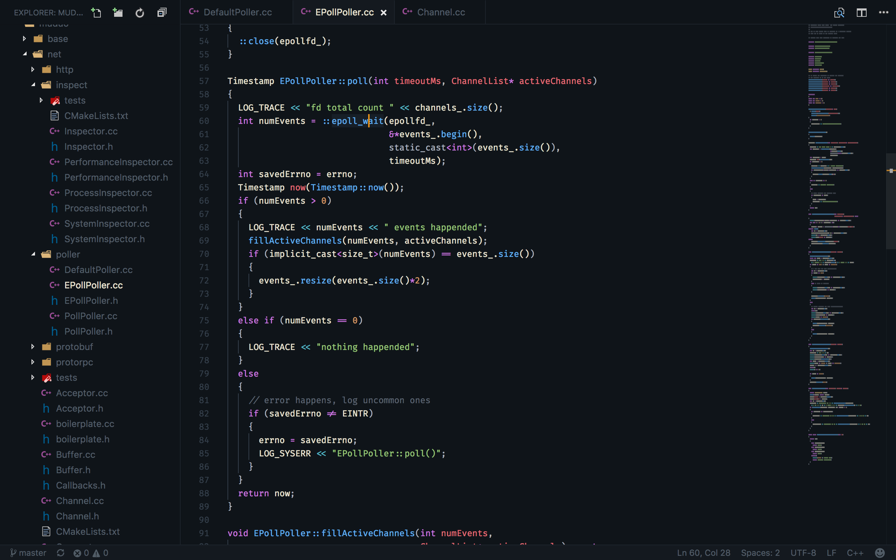

> Source from:
> https://github.com/teabyii/vscode-ayu
> https://github.com/Binaryify/OneDark-Pro

An theme base on `Any Dark` and `One Dark Pro` theme.

## Install

```shell
ext install ayu-one-dark
```

Then go to `Preferences > Color Theme > Ayu One Dark`.

## Screenshots

#### One Dark



## Development

Install dependencies
```shell
npm install
```

Update themes and build VSIX package
```shell
npm run build && npm run package
```
